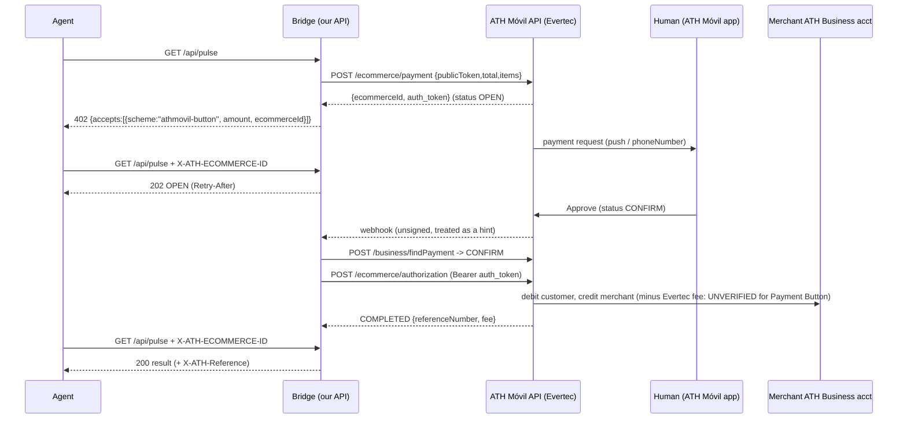

# SPIKE: ATH Móvil agent-pay bridge (local mock only)

Research only. No real account, no signup, no funds, no deploy, no merge. Evertec has **no testing environment** ("We currently do not have a Testing environment", https://github.com/evertec/ATHM-Payment-Button-API), so this runs against a **local mock** of the documented API shapes.

Run: `node spikes/ath-movil-bridge/demo.mjs` (Node 18+, no deps). Expected last line: `DEMO PASS`. Sample: `demo-output.txt`.

Funds go from the customer's ATH Móvil account **directly to the merchant's ATH Business account**. The bridge stores only `ecommerceId`, `auth_token`, status and `referenceNumber`. It never holds, pools or routes funds.

Files: `mock-ath.mjs` (mock of /payment, /business/findPayment, /authorization, the webhook subscribe call, plus a mock-only `/__mock/customer` standing in for the human), `bridge.mjs` (402 → poll/webhook → verify → authorize → release), `demo.mjs` (approve path + cancel path).

Gaps vs real API (UNKNOWN until we have a merchant account): exact error codes; whether `phoneNumber` is required for a push (it is optional in the docs); webhook retry/signing (none documented); JWT/Bearer for findPayment (the README shows a bare `Bearer`); real expiry timing (timeout is 120–600 s per docs).

## Fee (UNVERIFIED for Payment Button payments)
- https://ath.business/en/faq, "Limits and fees": "How much does this service cost? The service charge is only 2.25% for each payment received, with a minimum of $ 0.06. Paying your business through ATH Móvil is free for your customers." The same 2.25%/$0.06 text appears separately for donations.
- https://ath.business/en: "$0 monthly fees Pay only a flat rate of 2.25% per transaction".
- https://ath.business/terminos: fees "detailed in ath.business, in the Business section"; Evertec may "charge additional fees … at any time".
- No page names the Payment Button/eCommerce rate, and the API README's COMPLETED example shows `fee: 0.60` on `total: 1` (`netAmount: 0.40`). Confirm with Evertec before any pricing. The mock's fee is configurable (MOCK_ATH_FEE_PCT, MOCK_ATH_FEE_MIN).
